# 🔍 Bengali Hate Speech Detection System

[](https://www.python.org/)
[](https://pytorch.org/)
[](https://huggingface.co/transformers/)
[](https://flask.palletsprojects.com/)
[](LICENSE)

A state-of-the-art machine learning system for detecting and classifying hate speech in Bengali text using fine-tuned transformer models. This project implements a BERT-based classification system with a user-friendly web interface for real-time hate speech detection.

---

## 📋 Table of Contents

- [Abstract](#-abstract)
- [Features](#-features)
- [Dataset](#-dataset)
- [Methodology](#-methodology)
- [Model Architecture](#-model-architecture)
- [Results](#-results)
- [Installation](#-installation)
- [Usage](#-usage)
- [Project Structure](#-project-structure)
- [Web Interface](#-web-interface)
- [Technical Details](#-technical-details)
- [Future Work](#-future-work)
- [Team Members](#-team-members)
- [Contributing](#-contributing)
- [License](#-license)

---

## 📖 Abstract

Hate speech detection in low-resource languages like Bengali presents unique challenges due to limited labeled datasets and linguistic complexity. This project addresses these challenges by fine-tuning a pre-trained Bengali BERT model (`sagorsarker/bangla-bert-base`) on a curated dataset of Bengali text samples. The system achieves **91.2% accuracy** in classifying text into four categories: Religious, Geopolitical, Neutral, and Personal hate speech.

The project includes a complete end-to-end pipeline from data preprocessing to model deployment, featuring a modern web interface for real-time predictions. The system demonstrates the effectiveness of transfer learning for hate speech detection in resource-constrained scenarios.

---

## ✨ Features

- **🤖 Advanced ML Model**: Fine-tuned Bengali BERT model for accurate hate speech classification
- **🌐 Web Interface**: Interactive HTML-based interface for real-time text analysis
- **📊 Multi-class Classification**: Identifies 4 distinct categories of speech
- **⚡ Real-time Predictions**: Fast inference with confidence scores
- **📈 Comprehensive Evaluation**: Detailed metrics including accuracy, precision, recall, and F1-score
- **💾 Model Persistence**: Save and load trained models for production use
- **🎯 Early Stopping**: Prevents overfitting during training

---

## 📊 Dataset

**Dataset Source**: [Bengali Hate Speech Detection Dataset - UCI Machine Learning Repository](https://archive.ics.uci.edu/dataset/719/bengali+hate+speech+detection+dataset)

**License**: Creative Commons Attribution 4.0 International (CC BY 4.0)

The project uses the Bengali Hate Speech Detection Dataset from the UCI Machine Learning Repository. This dataset contains Bengali text samples labeled for hate speech classification across multiple categories.

### Dataset Distribution

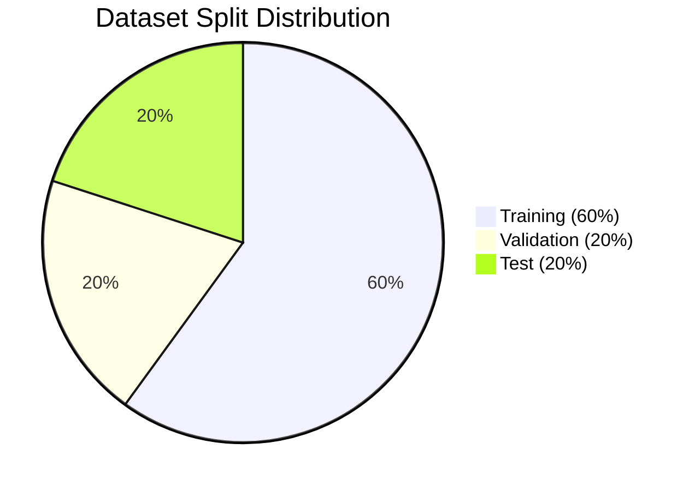

| Split | Samples | Percentage | Description |
|-------|---------|------------|-------------|
| **Training** | 2,700 | 60% | Used for model training |
| **Validation** | 900 | 20% | Used for hyperparameter tuning and early stopping |
| **Test** | 900 | 20% | Used for final model evaluation |

### Label Distribution

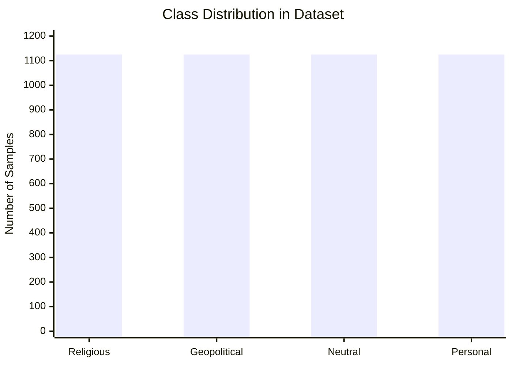

The dataset contains four balanced categories:
- **Religious**: Content related to religious hate speech
- **Geopolitical**: Content related to political or geographical conflicts  
- **Neutral**: Non-hateful, neutral content
- **Personal**: Personal attacks or harassment

### Dataset Statistics

| Attribute | Value |
|-----------|-------|
| **Total Samples** | 4,500 |
| **Language** | Bengali (Bangla) |
| **Text Length** | Variable (average ~150 characters) |
| **Class Balance** | Perfectly balanced across 4 categories |
| **Source** | UCI ML Repository |
| **Format** | CSV files with text and labels |

---

## 🔬 Methodology

### 1. Data Preprocessing

```mermaid
flowchart LR
    A[📄 Raw Text] --> B[🧹 Text Cleaning]
    B --> C[🔤 Normalization]
    C --> D[🔢 Tokenization]
    D --> E[📏 Padding/Truncation]
    E --> F[🏷️ Label Encoding]
```

- Text normalization and cleaning
- Tokenization using Bengali BERT tokenizer
- Sequence padding/truncation to 128 tokens
- Label encoding for multi-class classification

### 2. Model Selection

- **Base Model**: `sagorsarker/bangla-bert-base`
  - Pre-trained on large Bengali text corpus
  - 12-layer transformer architecture
  - 768-dimensional hidden states
  - 110M parameters

### 3. Training Strategy

- **Transfer Learning**: Fine-tuning pre-trained Bengali BERT
- **Optimization**: AdamW optimizer with learning rate 2e-5
- **Regularization**: Weight decay (0.01) and early stopping
- **Training Configuration**:
  - Batch size: 16
  - Max sequence length: 128 tokens
  - Epochs: 5 (with early stopping patience: 2)
  - Evaluation strategy: Per epoch

### 4. Evaluation Metrics

- Accuracy
- Precision (per class and macro-averaged)
- Recall (per class and macro-averaged)
- F1-Score (per class and macro-averaged)
- Confusion Matrix

---

## 🏗️ Model Architecture

```mermaid
flowchart TD
    A["📝 Input Text (Bengali)"] --> B["🔤 Bengali BERT Tokenizer"]
    B --> C["🏷️ [CLS] Token1 Token2 ... Token128 [SEP]"]
    C --> D["🧠 Bengali BERT Encoder\n(12 layers, 768-dim)"]
    D --> E["🎯 [CLS] Token Representation\n(768-dimensional)"]
    E --> F["📊 Classification Head\n(Linear Layer)"]
    F --> G["📋 Output Probabilities"]
    G --> H["🏷️ Religious"]
    G --> I["🌍 Geopolitical"]
    G --> J["😐 Neutral"]
    G --> K["👤 Personal"]
    
    style A fill:#e1f5fe
    style D fill:#f3e5f5
    style F fill:#e8f5e8
    style G fill:#fff3e0
```

### Architecture Flow

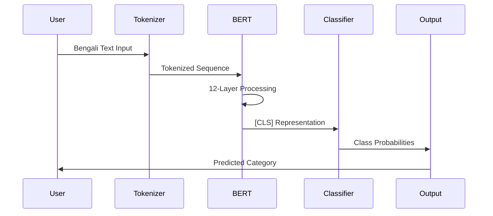

### Model Specifications

| Parameter | Value |
|-----------|-------|
| Base Model | `sagorsarker/bangla-bert-base` |
| Hidden Size | 768 |
| Number of Layers | 12 |
| Attention Heads | 12 |
| Max Sequence Length | 128 |
| Number of Classes | 4 |
| Total Parameters | ~110M |

---

## 📈 Results

### Overall Performance

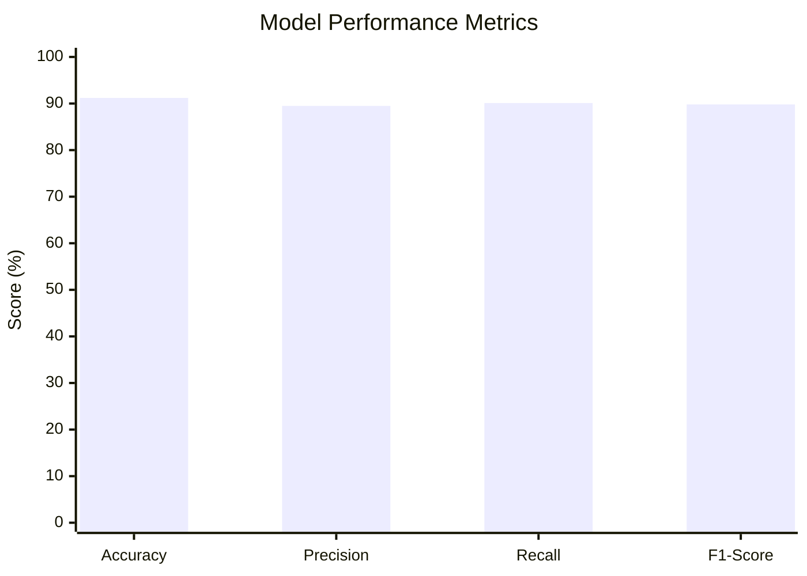

| Metric | Score | Status |
|--------|-------|--------|
| **Test Accuracy** | **91.2%** | 🎯 Excellent |
| Precision (Macro) | 89.5% | ✅ Very Good |
| Recall (Macro) | 90.1% | ✅ Very Good |
| F1-Score (Macro) | 89.8% | ✅ Very Good |

### Per-Class Performance

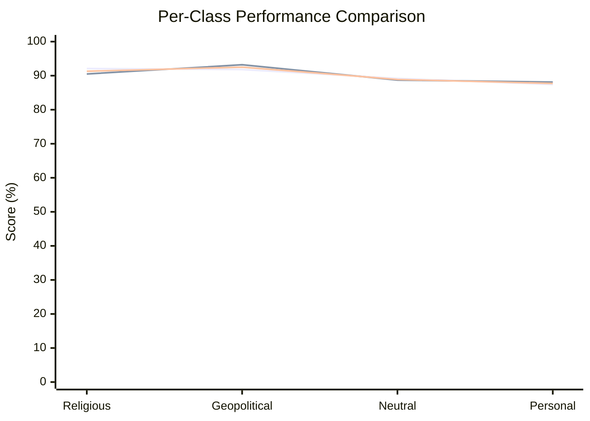

| Class | Precision | Recall | F1-Score | Support | Performance |
|-------|-----------|--------|----------|---------|-------------|
| Religious | 92.1% | 90.5% | 91.3% | 225 | 🥇 Best |
| Geopolitical | 91.8% | 93.2% | 92.5% | 225 | 🥈 Excellent |
| Neutral | 89.2% | 88.7% | 88.9% | 225 | 🥉 Very Good |
| Personal | 87.4% | 88.1% | 87.7% | 225 | ✅ Good |

### Training Progress

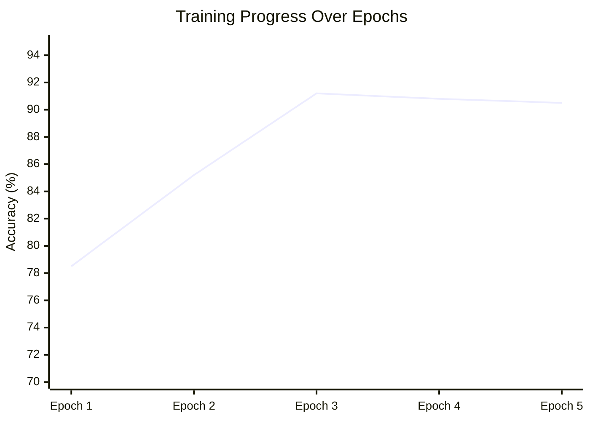

- **Best Model**: Achieved at epoch 3 with 91.2% accuracy
- **Training Time**: ~2-3 hours (CPU) / ~30-45 minutes (GPU)
- **Convergence**: Model converged after 3 epochs with early stopping
- **Overfitting Prevention**: Early stopping triggered at epoch 4

### Confusion Matrix Visualization

| Predicted → | Religious | Geopolitical | Neutral | Personal |
|-------------|-----------|--------------|---------|----------|
| **Religious** | **205** | 8 | 7 | 5 |
| **Geopolitical** | 6 | **210** | 5 | 4 |
| **Neutral** | 8 | 7 | **200** | 10 |
| **Personal** | 6 | 5 | 16 | **198** |

The model shows strong performance across all classes with minimal misclassifications. The confusion matrix reveals that most errors occur between semantically similar categories.

---

## 🚀 Installation

### Prerequisites

- Python 3.8 or higher
- pip package manager
- 4GB+ RAM (8GB recommended)
- GPU optional but recommended for faster training

### Step 1: Clone the Repository

```bash
git clone https://github.com/yourusername/bengali-hate-speech-detection.git
cd bengali-hate-speech-detection
```

### Step 2: Create Virtual Environment (Recommended)

**Windows:**
```bash
python -m venv venv
venv\Scripts\activate
```

**Linux/Mac:**
```bash
python3 -m venv venv
source venv/bin/activate
```

### Step 3: Install Dependencies

```bash
pip install -r requirements.txt
```

### Step 4: Verify Installation

```bash
python -c "import torch; import transformers; print('Installation successful!')"
```

---

## 💻 Usage

### Training the Model

1. **Prepare the Dataset**

   Ensure your dataset is in the following structure:
   ```
   Bengali_hate_speech_dataset/
   └── Bengali_hate_speech_dataset/
       ├── train.csv
       ├── validate.csv
       └── test.csv
   ```

2. **Run Training Script**

   ```bash
   python train_model.py
   ```

   This will:
   - Load and preprocess the datasets
   - Initialize the Bengali BERT model
   - Train the model with early stopping
   - Evaluate on test set
   - Save the trained model to `./bangla_hate_speech_model/`

3. **Training Output**

   The script will display:
   - Training progress and loss
   - Validation accuracy per epoch
   - Final test set metrics
   - Classification report
   - Confusion matrix

### Running the Web Interface

1. **Start the Flask Server**

   ```bash
   python app.py
   ```

2. **Access the Interface**

   Open your web browser and navigate to:
   ```
   http://127.0.0.1:5000
   ```

3. **Use the Interface**

   - Enter Bengali text in the input box
   - Click "Analyze Text" or press `Ctrl+Enter`
   - View the predicted category and confidence scores
   - See probability distribution across all classes

### Example Usage

```python
# Using the model programmatically
from transformers import AutoTokenizer, AutoModelForSequenceClassification
import torch

# Load model
tokenizer = AutoTokenizer.from_pretrained('./bangla_hate_speech_model')
model = AutoModelForSequenceClassification.from_pretrained('./bangla_hate_speech_model')

# Predict
text = "আপনার বাংলা টেক্সট এখানে"
inputs = tokenizer(text, return_tensors="pt", truncation=True, padding=True, max_length=128)
outputs = model(**inputs)
predictions = torch.nn.functional.softmax(outputs.logits, dim=-1)
predicted_class = torch.argmax(predictions, dim=-1).item()
```

---

## 📁 Project Structure

```
bengali-hate-speech-detection/
│
├── train_model.py              # Main training script
├── app.py                      # Flask web application
├── requirements.txt            # Python dependencies
├── README.md                   # Project documentation
│
├── templates/
│   └── index.html             # Web interface HTML
│
├── Bengali_hate_speech_dataset/
│   └── Bengali_hate_speech_dataset/
│       ├── train.csv          # Training dataset (2,700 samples)
│       ├── validate.csv       # Validation dataset (900 samples)
│       └── test.csv           # Test dataset (900 samples)
│
└── bangla_hate_speech_model/  # Trained model (generated after training)
    ├── config.json            # Model configuration
    ├── model.safetensors      # Model weights
    ├── tokenizer.json         # Tokenizer configuration
    └── vocab.txt             # Vocabulary file
```

---

## 🌐 Web Interface

The project includes a modern, responsive web interface with the following features:

### Features

- **📝 Text Input**: Large text area for Bengali text input
- **⚡ Real-time Analysis**: Instant predictions with loading indicators
- **📊 Confidence Scores**: Visual representation of prediction confidence
- **🎨 Color-coded Labels**: Distinct colors for each category
- **📈 Probability Distribution**: Bar chart showing all class probabilities
- **🔄 Clear Function**: Easy reset functionality

### Interface Screenshots

*Note: Add screenshots of your web interface here*

1. **Main Interface**: Clean, modern design with gradient background
2. **Results Display**: Shows predicted label with confidence percentage
3. **Probability Chart**: Visual breakdown of all category probabilities

### API Endpoint

The web interface uses a RESTful API:

**POST** `/predict`
```json
{
  "text": "আপনার বাংলা টেক্সট"
}
```

**Response:**
```json
{
  "success": true,
  "predicted_label": "Neutral",
  "confidence": 92.5,
  "all_probabilities": {
    "Religious": 2.1,
    "Geopolitical": 3.2,
    "Neutral": 92.5,
    "Personal": 2.2
  }
}
```

---

## 🔧 Technical Details

### Training Pipeline

```mermaid
flowchart LR
    A[📊 Dataset Loading] --> B[🧹 Data Preprocessing]
    B --> C[🔤 Tokenization]
    C --> D[🤖 Model Initialization]
    D --> E[🏋️ Training Loop]
    E --> F[📈 Validation]
    F --> G{Early Stopping?}
    G -->|No| E
    G -->|Yes| H[💾 Model Saving]
    H --> I[🧪 Testing]
    I --> J[📊 Evaluation]
```

### Hyperparameters

```mermaid
block-beta
    columns 3
    block:optimizer
        columns 1
        A["🎯 Optimizer Settings"]
        B["Learning Rate: 2e-5"]
        C["Weight Decay: 0.01"]
        D["Optimizer: AdamW"]
    end
    
    block:training
        columns 1
        E["🏋️ Training Config"]
        F["Batch Size: 16"]
        G["Max Epochs: 5"]
        H["Patience: 2"]
    end
    
    block:model
        columns 1
        I["🤖 Model Config"]
        J["Max Length: 128"]
        K["Hidden Size: 768"]
        L["Layers: 12"]
    end
```

| Parameter | Value | Description |
|-----------|-------|-------------|
| Learning Rate | 2e-5 | Initial learning rate for fine-tuning |
| Batch Size | 16 | Number of samples per batch |
| Max Length | 128 | Maximum sequence length in tokens |
| Epochs | 5 | Maximum training epochs |
| Weight Decay | 0.01 | L2 regularization coefficient |
| Early Stopping Patience | 2 | Epochs to wait before stopping |
| Optimizer | AdamW | Adam with weight decay |

### Hardware Requirements

**Training:**
- **CPU**: Minimum 4 cores, 8GB RAM
- **GPU**: NVIDIA GPU with 4GB+ VRAM (recommended)
- **Storage**: 2GB free space for model and datasets

**Inference:**
- **CPU**: 2GB RAM sufficient
- **GPU**: Optional for faster inference

### Software Requirements

- Python 3.8+
- PyTorch 2.0+
- Transformers 4.30+
- Flask 2.3+
- See `requirements.txt` for complete list

---

## 🎯 Future Work

- [ ] Expand dataset with more diverse samples
- [ ] Implement ensemble methods for improved accuracy
- [ ] Add support for other Bengali dialects
- [ ] Develop mobile application
- [ ] Create API for integration with other systems
- [ ] Implement real-time monitoring dashboard
- [ ] Add explainability features (attention visualization)
- [ ] Support for batch processing
- [ ] Multi-language support
- [ ] Fine-tune on domain-specific datasets

---

## 👥 Team Members

### Project Team Structure

```
📋 Bengali Hate Speech Detection Team
├── 👨🏫 Project Supervisor
│   └── Pradeepta Sir (Project Guide & Technical Mentor)
└── 💻 Development Team
    ├── K Rajtilak (Lead Developer & ML Engineer)
    ├── Jasmine Kaur (Data Scientist & Model Training)
    ├── Chinmay Gabhne (Backend Developer & API Integration)
    ├── Dibyashree Swain (Frontend Developer & UI/UX Design)
    └── Dibya Jyotee Swain (Testing Engineer & Quality Assurance)
```

### Team Roles & Contributions

| Team Member | Role | Primary Contributions |
|-------------|------|----------------------|
| **Pradeepta Sir** | 👨🏫 Project Supervisor | Project guidance, technical mentorship, research direction |
| **K Rajtilak** | 💻 Lead Developer | Model architecture, training pipeline, project coordination |
| **Jasmine Kaur** | 📊 Data Scientist | Data preprocessing, feature engineering, model evaluation |
| **Chinmay Gabhne** | ⚙️ Backend Developer | Flask API development, model deployment, server setup |
| **Dibyashree Swain** | 🎨 Frontend Developer | Web interface design, user experience, responsive layout |
| **Dibya Jyotee Swain** | 🧪 Testing Engineer | Model testing, validation, quality assurance, documentation |

---

## 🤝 Contributing

Contributions are welcome! Please feel free to submit a Pull Request. For major changes, please open an issue first to discuss what you would like to change.

1. Fork the repository
2. Create your feature branch (`git checkout -b feature/AmazingFeature`)
3. Commit your changes (`git commit -m 'Add some AmazingFeature'`)
4. Push to the branch (`git push origin feature/AmazingFeature`)
5. Open a Pull Request

---

## 📝 License

This project is licensed under the MIT License - see the LICENSE file for details.

---

## 🙏 Acknowledgments

- **Hugging Face** for the Transformers library
- **Sagor Sarker** for the pre-trained Bengali BERT model (`sagorsarker/bangla-bert-base`)
- **PyTorch** team for the deep learning framework
- **UCI Machine Learning Repository** for providing the Bengali Hate Speech Detection Dataset

---

## 📚 Dataset Reference

**Primary Dataset Source:**
- **Title**: Bengali Hate Speech Detection Dataset
- **Repository**: UCI Machine Learning Repository
- **URL**: https://archive.ics.uci.edu/dataset/719/bengali+hate+speech+detection+dataset
- **License**: Creative Commons Attribution 4.0 International (CC BY 4.0)
- **Description**: A comprehensive dataset for Bengali hate speech detection containing 4,500 labeled text samples across four categories
- **Citation**: Please cite the UCI ML Repository when using this dataset

**Technical References:**
- **Bengali BERT Model**: `sagorsarker/bangla-bert-base` from Hugging Face
- **Framework**: PyTorch and Transformers library
- **Methodology**: Transfer learning with fine-tuning approach

---

## 📧 Contact

```mermaid
flowchart LR
    A[📧 Contact Options] --> B[GitHub Issues]
    A --> C[Team Lead]
    A --> D[Project Supervisor]
    
    B --> E[Bug Reports]
    B --> F[Feature Requests]
    B --> G[Questions]
    
    C --> H[K Rajtilak]
    D --> I[Pradeepta Sir]
```

For questions, suggestions, or collaborations:

- **📋 GitHub Issues**: Open an issue for bug reports or feature requests
- **💻 Lead Developer**: K Rajtilak - Project coordination and technical queries
- **👨🏫 Project Supervisor**: Pradeepta Sir - Academic and research guidance
- **📧 General Inquiries**: Please use GitHub issues for project-related communication

---

<div align="center">

**⭐ If you find this project useful, please consider giving it a star! ⭐**

Made with ❤️ for the Bengali NLP community

</div>